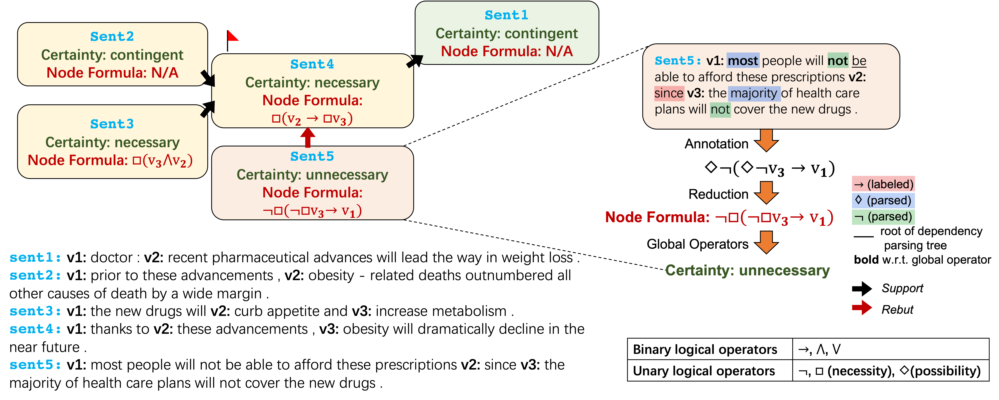

# MetaLogic

## Overview
This repository contains MetaLogic, a logical reasoning explanation dataset with fine-grained structure. 

<div align="center">
    
</div>

Our paper "MetaLogic: Logical Reasoning Explanations with Fine-Grained Structure" is accepted by EMNLP 2022.

## Dataset
`metalogic/metalogic_train.json`, `metalogic/metalogic_dev.json`, `metalogic/metalogic_test.json` are the training, development and test sets, respectively. The format of data item:
* `id_string`: data id.
* `proof`: the meta-structure.
* `sent_dict`
  * `sent`: the plain sentence.
  * `inner_info`
    * `inner_sent_w_variables`: the sentence with variable delimitation.
    * `global_operator`: the global operators.
    * `degree_label`: the degree-of-certainty label.
    * `inner_formula`: the formula.
    * `inner_formula_readable`: the formula (human readable).
    * `formula_triples`: the formula triples.
  * `gold_item`
    * `proof_str`
    * `triple_str_dict`
    * `proof`
    * `triples_dict`
    * `degree_str_dict`
    * `degree_dict`
  * `meta_info`
    * `context`: original context in [ReClor](https://github.com/yuweihao/reclor).
    * `question`: original question in [ReClor](https://github.com/yuweihao/reclor).
    * `option`: the original correct option in [ReClor](https://github.com/yuweihao/reclor).
    

## Code
Implementation of the following baselines are also available:
* All-at-Once [T5](https://www.jmlr.org/papers/volume21/20-074/20-074.pdf?ref=https://githubhelp.com)
* MultiTask [T5](https://www.jmlr.org/papers/volume21/20-074/20-074.pdf?ref=https://githubhelp.com)
* [MetGen](https://arxiv.org/pdf/2205.02593.pdf)


### All-at-Once (Once) T5
Fine-tuning T5-11b
```angular2html
export CUDA_VISIBLE_DEVICES=0,1,2,3,4,5,6,7
cd $ROOT_DIR/code
python3 OnceGenerator.py \
    --train_data ../metalogic/metalogic_train.json \
    --dev_data ../metalogic/metalogic_dev.json \
    --test_data ../metalogic/metalogic_test.json \
    --model_name_or_path t5-11b \
    --bs 4 --lr 1e-5 --epochs 500 --adafactor \
    --eval_epoch 10 \
    --code_dir $ROOT_DIR/code \
    --exp_dir $ROOT_DIR/exp/once \
    --save_model
```
Fine-tuning T5-large
```angular2html
export CUDA_VISIBLE_DEVICES=0 
cd $ROOT_DIR/code
python3 OnceGenerator.py \
    --train_data ../metalogic/metalogic_train.json \
    --dev_data ../metalogic/metalogic_dev.json \
    --test_data ../metalogic/metalogic_test.json \
    --model_name_or_path t5-large \
    --bs 32 --lr 1e-5 --epochs 200 --adafactor \
    --eval_epoch 10 \
    --code_dir $ROOT_DIR/code \
    --exp_dir $ROOT_DIR/exp/once_large \
    --save_model
```
Inference
```angular2html
export CUDA_VISIBLE_DEVICES=0
cd $ROOT_DIR/code
python3 inference.py \
    --data_path ../metalogic/metalogic_test.json \
    --inference_type once \
    --exp_dir $EXP_DIR \
    --model_name best_model.pth
```


### Multitask T5
Fine-tuning T5-11b
```angular2html
export CUDA_VISIBLE_DEVICES=0,1,2,3,4,5,6,7
cd $ROOT_DIR/code
python3 MultitaskGenerator.py \
    --multitask_type multi \
    --sampling_temperature 1 \
    --train_data ../metalogic/metalogic_train.json \
    --dev_data ../metalogic/metalogic_dev.json \
    --test_data ../metalogic/metalogic_test.json \
    --model_name_or_path t5-11b \
    --bs 4 --lr 1e-5 --epochs 500 --adafactor \
    --eval_epoch 10 \
    --code_dir $ROOT_DIR/code \
    --exp_dir $ROOT_DIR/exp/multi \
    --save_model
```
Fine-tuning T5-large
```angular2html
export CUDA_VISIBLE_DEVICES=0
cd $ROOT_DIR/code
python3 MultitaskGenerator.py \
    --multitask_type multi \
    --sampling_temperature 1 \
    --train_data ../metalogic/metalogic_train.json \
    --dev_data ../metalogic/metalogic_dev.json \
    --test_data ../metalogic/metalogic_test.json \
    --model_name_or_path t5-large \
    --bs 32 --lr 1e-5 --epochs 200 --adafactor \
    --eval_epoch 10 \
    --code_dir $ROOT_DIR/code \
    --exp_dir $ROOT_DIR/exp/multi_large \
    --save_model
```
Inference
```angular2html
export CUDA_VISIBLE_DEVICES=0
cd $ROOT_DIR/code
python3 inference.py \
    --data_path ../metalogic/metalogic_test.json \
    --inference_type multi \
    --exp_dir $EXP_DIR \
    --model_name best_model.pth
```

### MetGen
Fine-tuning T5-11b
```angular2html
export CUDA_VISIBLE_DEVICES=0,1,2,3,4,5,6,7
cd $ROOT_DIR/code
python3 MultitaskGenerator.py \
    --multitask_type metgen \
    --sampling_temperature 1 --neg_pos_rate 2.0 \
    --train_data ../metalogic/metalogic_train.json \
    --dev_data ../metalogic/metalogic_dev.json \
    --test_data ../metalogic/metalogic_test.json \
    --model_name_or_path t5-11b \
    --bs 4 --lr 1e-5 --epochs 300 --adafactor \
    --eval_epoch 10 \
    --code_dir $ROOT_DIR/code \
    --exp_dir $ROOT_DIR/exp/metgen \
    --save_model
```
Fine-tuning T5-large
```angular2html
export CUDA_VISIBLE_DEVICES=0
cd $ROOT_DIR/code
python3 MultitaskGenerator.py \
    --multitask_type metgen \
    --sampling_temperature 1 --neg_pos_rate 2.0 \
    --train_data ../metalogic/metalogic_train.json \
    --dev_data ../metalogic/metalogic_dev.json \
    --test_data ../metalogic/metalogic_test.json \
    --model_name_or_path t5-large \
    --bs 32 --lr 1e-5 --epochs 300 --adafactor \
    --eval_epoch 10 \
    --code_dir $ROOT_DIR/code \
    --exp_dir $ROOT_DIR/exp/metgen_large \
    --save_model
```
Inference
```angular2html
export CUDA_VISIBLE_DEVICES=0
cd $ROOT_DIR/code
python3 inference.py \
    --data_path ../metalogic/metalogic_test.json \
    --inference_type metgen \
    --exp_dir $EXP_DIR \
    --model_name best_model.pth
```

### View the evaluation results
```angular2html
cd $ROOT_DIR/code
python3 show_results.py --prediction_path $EXP_DIR/evaluation/$FILE_NAME
```
